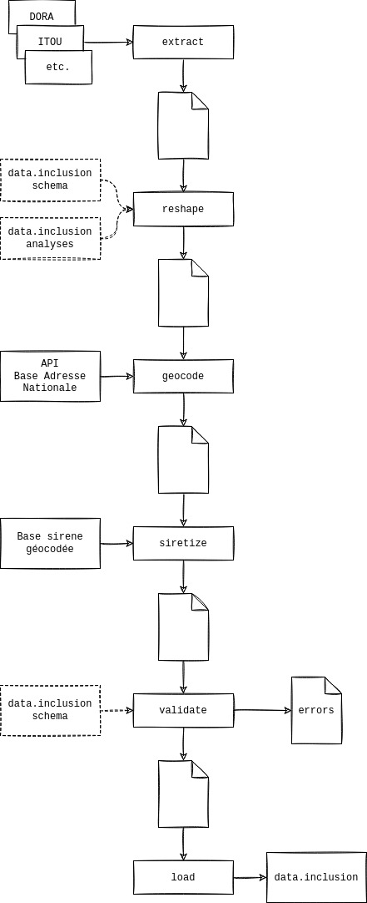

# `data-inclusion-scripts`

Ce dépôt contient des workflows pour le traitement des données de l'inclusion.

## Installation

`python3.10` est la version actuellement supportée. Installation recommandée via [`pyenv`](https://github.com/pyenv/pyenv).


```bash
cd /tmp/

# Créer et activer un nouvel environnement virtuel
python3.10 -m venv .venv
source .venv/bin/activate

# Installer le package
pip install -U pip setuptools wheel
pip install git+https://github.com/betagouv/data-inclusion-scripts.git@main

# Vérifier l'installation
data-inclusion --help
```

## Usage

### `extract`

Extraire des données

Produit, à partir d'un type de source et d'un lien vers la source (une URL typiquement), un fichier unique non transformé.

```bash
$ data-inclusion extract --help

Usage: data-inclusion extract [OPTIONS] SRC

  Extract data from a given source type and path.

Options:
  --src-type [cd35|dora|itou|siao|odspep|soliguide]
  --help                          Show this message and exit.
```

#### Exemple

```bash
# extraction des données de type dora depuis l'environnement staging de dora
data-inclusion extract --src-type dora https://api.dora.incubateur.net/api/v1/structures/
```

### `reshape`

Remodeler un fichier dans le format data.inclusion

### `geocode`

Géocode un fichier au format data.inclusion

### `validate`

Evalue la conformité d'un fichier au format data.inclusion

### `process`

ETL de bout en bout

## Développement

* Les tâches sont découpées en scripts unitaires:
  * `extract --src-type SRC_TYPE` : extraction par source
  * `reshape --src-type SRC_TYPE` : transformation par source
  * `geocode` : geocodage
  * etc.
* En régle général, chaque script attend un fichier en entrée et produit un fichier en sortie dans le répertoire courant.
* Les scripts sont exécutés régulièrement grâce à la ci de github (cf [`.github/workflows/main.yml`](.github/workflows/main.yml)).
* Les scripts ont vocation à être via différents points d'entrée: CLI, PythonOperator d'Airflow.
* La validation du schéma est effectuée via `pydantic`.

### Pipeline



## [Auteurs](CODEOWNERS)

## [Licence](LICENSE)
